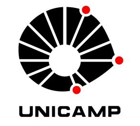

# Deep Learning aplicado a sistemas de buscas - IA368 DD

Registro do Curso [IA368 - Tópicos em Engenharia de Computação V - Turma: DD](https://www.cpg.feec.unicamp.br/cpg/lista/caderno_horario_show.php?id=1779)

Disciplina oferecida no período 1/2023, pelo [programa de pós-graduação da FEEC-Unicamp](https://www.fee.unicamp.br/pos-graduacao/).

## Materiais principais 
* [Ementa do curso](ementa.md)
* Cursos anteriores:
  * [IA025 - Introdução ao Aprendizado Profundo](https://github.com/leonardo3108/ia025a)
  * [IA376 - Deep Learning for NLP](https://colab.research.google.com/github/robertoalotufo/rnap/blob/master/PyTorch/0_index.ipynb)
* [Slides do curso](Slides%20do%20Curso.pdf)
* [Instruções, regras e dicas](instrucoes.md)
* [Laboratório de Processamento de Linguagem Natural e Deep Learning DCA-FEEC UNICAMP](https://sites.google.com/unicamp.br/deep-learning-nlp)
* [Comunidade no Hugging Face](https://huggingface.co/unicamp-dl)
* Projeto final:
  * Repositório de código: https://github.com/marcusborela/ind-e
  * Mural: https://miro.com/app/board/uXjVO-OAf1w=/

## Seleção para vaga de aluno especial - Exercício
* [Instruções para o Projeto](selecao/exercicio-selecao.md)
* [Google Colab notebook - Baseline BM25](selecao/Baseline_BM25.ipynb)
* [Report generated](selecao/report.md)

## Roteiro das aulas e atividades

### Aula 1 - 02/03/2023
* Assuntos
  * Apresentação do curso
  * [Instruções, regras e dicas](instrucoes.md)
* Exercício - [Seleção para vaga de aluno especial](selecao#sele%C3%A7%C3%A3o-para-vaga-de-aluno-especial---exerc%C3%ADcio)
  * [Enunciado](selecao/exercicio-selecao.md)
  * [Notebook](selecao/Baseline_BM25.ipynb)
  * [Relatório](selecao/report.md)
* Materiais complementares

### Aula 2 - 09/03/2023
* Assuntos
  * Buscador booleano e BM25
* Exercício - [Buscador booleano/BoW e TF-IDF](exercicios/Aula%202/README.md)
  * [Enunciado](exercicios/Aula%202/README.md#enunciado)
  * [Artefatos gerados](exercicios/Aula%202/README.md#artefatos-gerados)
* Leitura/resumo
  * Artigo: [Pretrained Transformers for Text Ranking: BERT and Beyond](https://arxiv.org/abs/2010.06467) - Ler até final do capítulo 1
    * [Artigo anotado](artigos/Aula%202/Pretrained%20Transformers%20for%20Text%20Ranking%20-%20BERT%20and%20Beyond%20-%20anotado.pdf)	           
* Materiais complementares

### Aula 3 - 16/03/2023
* Assuntos
  * Reranqueamento com classificador neural
* Exercício
  * [Enunciado](exercicios/Aula_3/enunciado.md)
  * [Notebook](exercicios/Aula_3/Aula_3_Rerank.ipynb)
* Leitura/resumo
  * Artigo: [Pretrained Transformers for Text Ranking: BERT and Beyond](https://arxiv.org/abs/2010.06467) - Ler a Seção 3 até a 3.2.2
    * [Artigo anotado](artigos/Aula%202/Pretrained%20Transformers%20for%20Text%20Ranking%20-%20BERT%20and%20Beyond%20-%20anotado.pdf)	           
* Materiais complementares

### Aula 4 - 23/03/2023
* Assuntos
  * LLM - aprendizado contextual
* Exercício
  * [Enunciado](exercicios/Aula_4/enunciado.md)
  * [Notebook](exercicios/Aula_4/Sentiment_Analisys_with_GPT_3_1000_texts.ipynb)
  * [Apresentação](exercicios/Aula_4/Notebook%20-%20Aula%204.pptx)
* Leitura/resumo
  * Artigo: [Language Models are Few-Shot Learners](https://arxiv.org/pdf/2005.14165.pdf)
    * [Artigo anotado](artigos/Aula_4/Language%20Models%20are%20Few-Shot%20Learners%20-%20Anotado.pdf)
  * [Apresentação](artigos/Aula_4/Language_Models_are_Few-Shot_Learners.pptx)
* Materiais complementares

### Aula 5 - 30/03/2023
* Assuntos
  * Treino de Modelo de Linguagem
* Exercício
  * [Enunciado](exercicios/Aula_5/enunciado.md)
  * [Notebook](exercicios/Aula_5/Aula_5_Treino_Modelo_de_Linguagem.ipynb)
  * [Apresentação](exercicios/Aula_5/Aula%204_5%20-%20Notebook%20Treino%20Modelo%20de%20Linguagem.pptx)
* Leitura/resumo
  * Artigo: [Language Models are Unsupervised Multitask Learners](https://d4mucfpksywv.cloudfront.net/better-language-models/language_models_are_unsupervised_multitask_learners.pdf)
    * [Artigo anotado](artigos/Aula_5/language_models_are_unsupervised_multitask_learners%20-%20anotado.pdf)
  * [Apresentação](artigos/Aula_5/Language_Models_are_Unsupervised_Multitask_Learners.pptx)
* Materiais complementares

### Aula 6 - 13/04/2023
* Assuntos
  * doc2query
* Exercício - [Aula 5/6](exercicios/Aula_6/ex6.md)
  * [Enunciado](exercicios/Aula_6/ex6.md#enunciado)
  * [Notebooks](exercicios/Aula_6/ex6.md#solução---etapas)
  * [Apresentação](exercicios/Aula_6/Aula%205_6%20-%20Notebooks%20T5%20%2B%20Doc2query.pptx)
* Leitura/resumo
  * Artigo: [Document Expansion by Query Prediction](https://arxiv.org/pdf/1904.08375.pdf)
    * [Artigo anotado](artigos/Aula_6/Document%20Expansion%20by%20Query%20Prediction%20-%20Anotado.pdf)
  * Artigo: [From doc2query to docTTTTTquery](https://www.researchgate.net/profile/Rodrigo-Nogueira-19/publication/360890853_From_doc2query_to_docTTTTTquery/links/6290b0e98d19206823dfcc55/From-doc2query-to-docTTTTTquery.pdf)
    * [Artigo anotado](artigos/Aula_6/From%20doc2query%20to%20docTTTTTquery%20-%20Anotado.pdf)
  * [Apresentação](artigos/Aula_6/doc2query.pptx)
* Materiais complementares

### Aula 7 - 20/04/2023
* Assuntos
  * busca densa
* Exercício - [Aula 6/7 - fazer-finetuning-de-um-buscador-denso](exercicios/Aula_7/ex7.md)
  * [Enunciado](exercicios/Aula_7/ex7.md#enunciado---fazer-finetuning-de-um-buscador-denso)
  * [Notebooks](exercicios/Aula_7/ex7.md#solução---etapas)
  * [Apresentação](exercicios/Aula_7/Aula%206_7%20-%20Fazer%20finetuning%20de%20um%20buscador%20denso.pptx)
* Leitura/resumo
  * Artigo: [Dense Passage Retrieval for Open-Domain Question Answering](https://arxiv.org/pdf/2004.04906.pdf)
    * [Artigo anotado](artigos/Aula_7/Dense%20Passage%20Retrieval%20for%20Open-Domain%20Question%20Answering%20-%20anotado.pdf)
  * Artigo: [ColBERT: Efficient and Effective Passage Search via Contextualized Late Interaction over BERT  (https://arxiv.org/pdf/2004.12832.pdf) - opcional
    * [Artigo anotado](artigos/Aula_7/ColBERT%20-%20Eficient%20and%20Effective%20Passage%20Search%20via%20Contextualized%20Late%20Interaction%20over%20BERT%20-%20anotado.pdf)
  * [Apresentação](artigos/Aula_7/DPR+ColBERT.pptx)
* Materiais complementares

### Aula 8 - 27/04/2023
* Assuntos
  * busca esparsa aprendida
* Exercício - Busca esparsa - SPLADE
  * [Enunciado](exercicios/Aula_8/enunciado.md)
  * [Notebook](exercicios/Aula_8/Aula_8_SPLADE.ipynb)
  * [Apresentação](exercicios/Aula_8/Aula%207_8%20-%20Notebook%20-%20SPLADE.pptx)
* Leitura/resumo
  * Artigo: [SPLADE: Sparse Lexical and Expansion Model for First Stage Ranking](https://arxiv.org/pdf/2107.05720.pdf)
  * Artigo: [SPLADE v2: Sparse Lexical and Expansion Model for Information Retrieval](https://arxiv.org/pdf/2109.10086.pdf) - opcional
  * [Apresentação](artigos/Aula_8/SPLADE.pptx)
* Materiais complementares

### Aula 9 - 04/05/2023
* Assuntos
  * Transfer Learning usando LLMs
  * Geração de datasets para busca com InPars
* Exercício - [Aula 8/9](exercicios/Aula_9/ex9.md) - InPars
  * [Enunciado](exercicios/Aula_9/enunciado.md)
  * [Notebooks](exercicios/Aula_9/ex9.md#solução---etapas)
  * Apresentação
* Leitura/resumo
  * Artigo: [InPars: Unsupervised Dataset Generation for Information Retrieval](https://arxiv.org/pdf/2202.05144.pdf)
    * Artigo anotado
  * Artigo: [InPars-v2: Large Language Models as Efficient Dataset Generators for Information Retrieval](https://arxiv.org/pdf/2301.01820.pdf)
    * Artigo anotado
  * Resumo
* Materiais complementares

### Aula 10 - 11/05/2023
* Assuntos
* Exercício
  * Enunciado
  * Notebook
  * Apresentação
* Leitura/resumo
  * Artigo
    * Artigo anotado
  * Resumo
* Materiais complementares

### Aula 11 - 18/05/2023
* Assuntos
* Exercício
  * Enunciado
  * Notebook
  * Apresentação
* Leitura/resumo
  * Artigo
    * Artigo anotado
  * Resumo
* Materiais complementares

### Aula 12 - 25/05/2023
* Apresentação dos projetos

### Aula 13 - 15/06/2023
* Apresentação dos projetos

### Aula 14 - 22/06/2023
* Apresentação dos projetos

### Aula 15 - 29/06/2023
* Apresentação dos projetos
